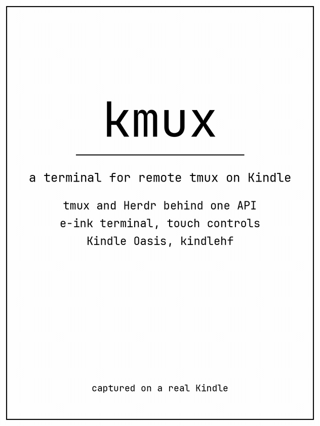

# kmux

## An e-ink terminal for remote development.

kmux turns a jailbroken Kindle into a terminal for remote development. It
brings multiple machines, tmux sessions, Herdr workspaces, coding agents, and
shells into one simple interface, with input and navigation designed for an
e-ink screen. The Kindle renders a compact 80×24 terminal, keeps history
readable, and adds touch-friendly controls for sessions, tabs, panes, copy
mode, files, snippets, and agent status.



The demo is captured from a real Kindle Oasis. It shows the complete advertised
tour: connection, command input, scrollback search, file paths, snippets,
compose, tmux/Herdr navigation, copy and yank, tabs, clipboard history, and
agent badges.

## How it works

There are two parts:

- `kmuxd` runs on the Kindle as the LIPC service `dev.qingshan.kmuxd`.
- `kmux-proxy` runs on a server and connects to configured machines over SSH.

The proxy presents tmux and Herdr through one versioned HTTP API. A machine is
configured with one backend; the UI maps tmux sessions/windows/panes and Herdr
workspaces/tabs/panes into the same navigation model.

| kmux | tmux | Herdr |
| --- | --- | --- |
| Machine | SSH host | SSH host |
| Session | tmux session | Workspace |
| Tab | Window | Tab |
| Pane | Existing pane | Existing pane |

kmux navigates existing panes; it does not create or split panes. The selected
terminal pane is kept at 80×24. See [Architecture](docs/architecture.md) for
the data flow and backend details.

## Why use it

- **Keep work visible.** Detach from a desktop or SSH client while tmux and
  Herdr continue running on the server.
- **Read on e-ink.** Dirty-row rendering, local scrollback, copy mode, and
  search make long output useful on a slower display.
- **One switcher.** Hosts, sessions, tabs, existing panes, and agent badges
  use the same controls for tmux and Herdr.
- **Stay in control.** Clipboard history, compose, quick snippets, file paths,
  and Diagnose are explicit actions; selecting an agent never sends input or
  approves a request.
- **Use the tools you already use.** tmux remains tmux, and Herdr remains
  Herdr. kmux is a Kindle client and proxy, not a replacement multiplexer.

## Install

You need a jailbroken Kindle with KPM and a reachable proxy server. The package
targets the Kindle Oasis 10th generation (`kindlehf`, firmware 5.16.x).

1. Obtain `kmux_<version>_kindlehf.kpkg`.
2. Copy it to the Kindle and install it with KPM.
3. Launch **kmux** from the Home screen.
4. Open Settings, enter the proxy token, and tap Save. HTTPS is the default;
   leave SOCKS5 blank for direct access.
5. Use **Diagnose** if the connection is not ready.

Settings live under `/mnt/us/kmux/var/` and survive package upgrades. Upgrade
the Kindle package and proxy together, and use a new package version because
KPM does not reinstall an identical version.

See [Installation and upgrades](docs/installation.md) for building, sideloading,
and rollback notes.

## Use the app

Tap the session chip to switch Hosts, Sessions, Panes, or Agents. Search is
scoped to the selected group. Tap tabs to switch windows, or open the tab menu
for tab actions and existing-pane navigation.

The lower controls provide:

- **Scroll** — local history, page navigation, and search.
- **Prompt** — context-aware control keys.
- **Tools → Files** — insert a path from the selected pane’s working directory.
- **Tools → Paste** — clipboard history from compose and copy-mode yanks.
- **Tools → Snippets** — load a packaged command or prompt into compose.
- **Tools → Agents** — inspect agent state across configured hosts.

Double-tap the terminal to compose longer or multiline text. Enter sends the
draft plus Enter; Shift+Enter adds a line; the send icon sends without Enter.
Copy mode freezes captured terminal history, supports search and selection, and
returns yanked text to clipboard history.

## Proxy

Build the native proxy on the machine that owns the SSH keys and tmux/Herdr
connections:

```sh
just proxy
./target/release/kmux-proxy /etc/kmux-proxy.json
```

The configuration contains a shared token, a default host, and a list of
backend-specific hosts. The proxy uses tmux control mode (`tmux -CC`) and a
metadata-only Herdr bridge. Read the [proxy guide](crates/kmux-proxy/README.md)
for configuration, API v1, events, security boundaries, and troubleshooting.

## Develop and test

```sh
just test       # Rust unit tests, proxy tests, and WAF tests
just e2e        # real isolated tmux + Herdr API tests; no Kindle required
just demo       # host tests plus the real-Kindle advertising tour
just demo-build # re-encode existing target/demo/frames
```

The single E2E entry point is `tests/e2e/kmux_e2e.py`. It provides Playwright-
like `ProxyPage` and `KindlePage` objects, retrying expectations, fixture
lifecycles, framebuffer screenshots, animation manifests, and MP4 rendering.
Read the [E2E guide](docs/e2e.md) before adding a scenario.

## Demo artifacts

`just demo` writes captured frames under `target/demo/` and rendered artifacts
under `dist/demo/`:

- `kmux-demo.gif` — the README feature tour, copied to `docs/kmux-demo.gif` for
  distribution.
- `kmux-demo.mp4` — native Kindle-resolution video.
- `kmux-demo-wide.mp4` — wide video for embeds.
- `kmux-demo-poster.png` — poster frame.

The demo uses isolated, named tmux and Herdr fixtures, pins the visible pane to
80×24, clears the scrollback search before entering `100`, and seeds snippets
for the recording. It restores the proxy host list and Kindle snippet file
after the run.

## License

kmux is released under the [MIT License](LICENSE).

## Built with Codex and Grok

kmux is built with hands-on engineering and AI assistance from
[OpenAI Codex](https://openai.com/codex/) and [Grok](https://grok.com/):
planning, implementation, debugging, documentation, and end-to-end testing
are reviewed against the running Kindle, proxy, and backend fixtures.
